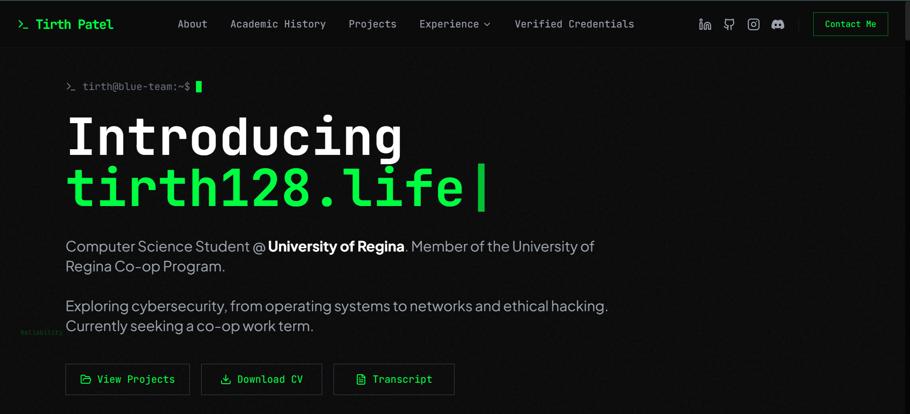
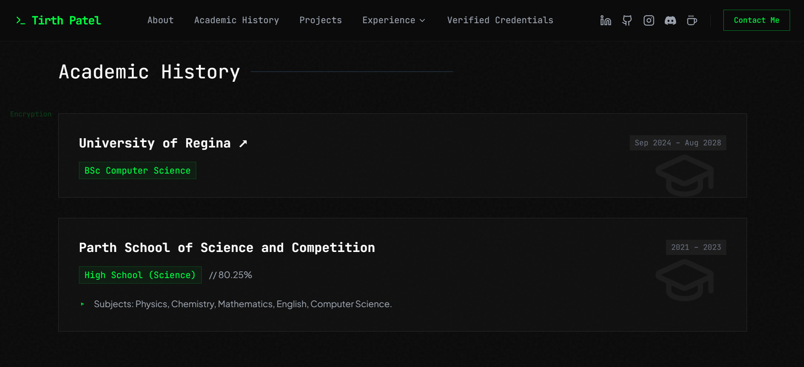
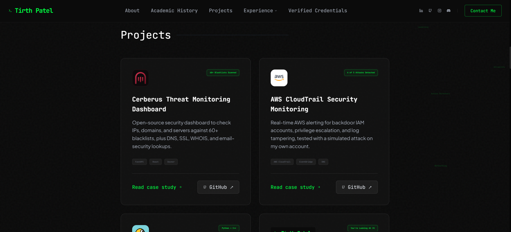
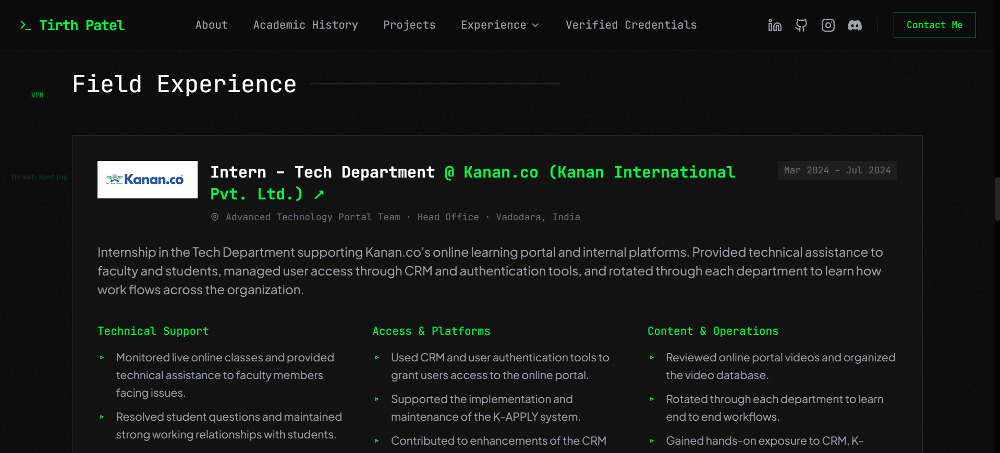
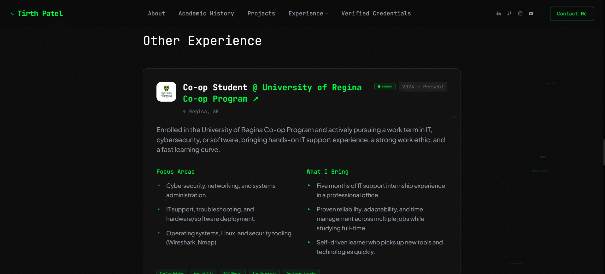
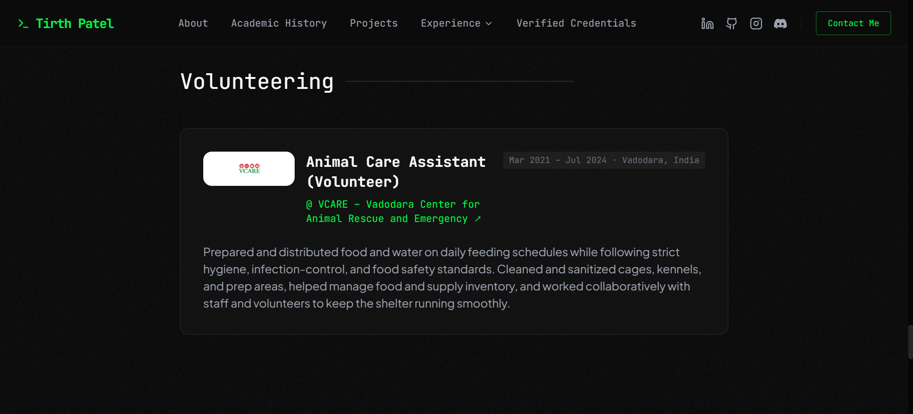
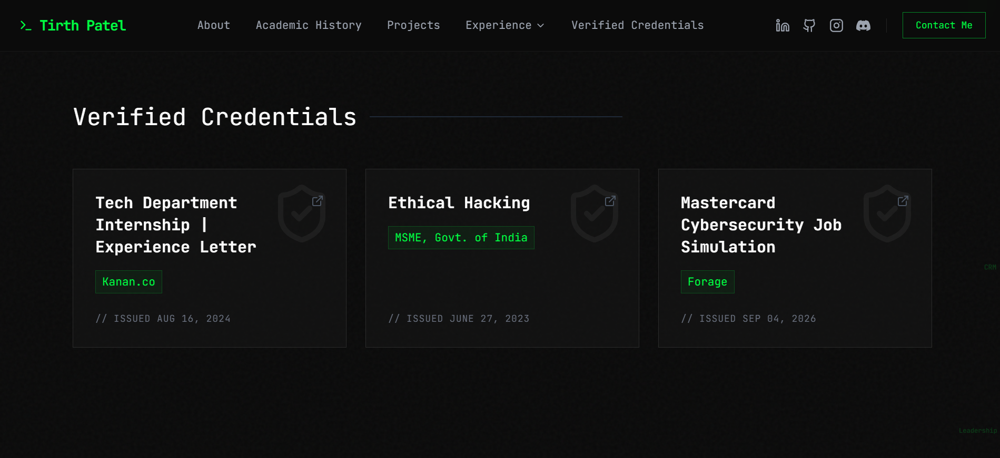

# Tirth Patel - Portfolio

Terminal-themed personal portfolio. Computer Science student at the University of Regina (Co-op Program), focused on cybersecurity: blue team, SOC, and cloud security.

**LinkedIn:** [linkedin.com/in/tirth1228](https://www.linkedin.com/in/tirth1228) · **Email:** pateltirth1228@gmail.com



---

## Academic History
BSc Computer Science at the University of Regina (2024 – 2028), plus high school.



## Projects
Security and software projects, each with its own case-study page and GitHub link.



## Experience
IT internship, the University of Regina Co-op Program, part-time roles, and volunteering.

<p>
  
  
</p>



## Verified Credentials
Certificates and experience letters, each linked to the original PDF.



---

## Built with
Next.js 14 · TypeScript · Tailwind CSS · HTML canvas (falling-words background)

## Run locally
```bash
npm install
npm run dev
```
Then open http://localhost:3000. All site content lives in `lib/data.ts`.
